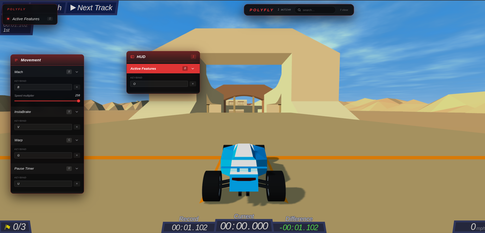
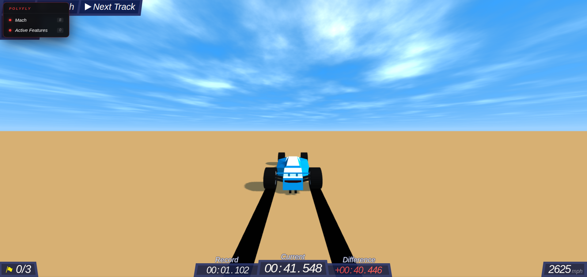

# PolyFly

PolyFly is a cheat client for the single player racing game PolyTrack. It hooks the game's physics and adds movement cheats plus an in-game menu. Everything applies on the next track load.

## Features

Press **Right Shift** to open or close the menu. Every cheat has its own key and you can rebind them in the menu.

**Mach** (B). Speed multiplier. Cranks the car's engine force so you accelerate way past normal speed. Set the multiplier as low or as high as you want.

**InstaBrake** (V). Kills your speed instantly. Holding the brake zeroes your velocity instead of slowing down over time, so you can stop on a dime for tight corners.

**Warp** (G). Teleports you forward. Each press jumps you to the next checkpoint, then to the finish once you've hit them all. Basically skips the track.

**Pause Timer** (U). Freezes the run timer while you keep driving. Hold it to stop the clock for better timing or to line up a shot, then let go to start it again.

**Slippy** (F). Reduces wheel grip. Lowers the tyres' friction so the car slides and drifts like it's on ice; the grip slider goes from 0 (no grip) up to stock — drop it for slides, raise it back for normal handling.

**Active Features / HUD** (H). Corner overlay that shows which cheats you have on right now.

## How it works

PolyTrack runs its physics in a WebAssembly (WASM) module inside a background worker. PolyFly patches that module instead of touching the game's main code.

On load, the extension swaps in a modified physics WASM. The modified build exposes values the normal game keeps hidden, like engine force and the car's position. PolyFly writes to those values while you play, which is how Mach and InstaBrake change the car in real time. Warp and Pause Timer go a step further and patch the worker's code so they can grab checkpoint positions and rewrite the timer.

The menu and HUD sit on top as a separate layer. They just toggle cheats and push your settings down to the physics worker.

## Installing

Manifest V3 extension. It already ships with the built `dist` folder, so there's nothing to compile. Just load it.

1. Download the extension folder (the one with `manifest.json` in it).
2. Open `chrome://extensions`.
3. Turn on **Developer mode** in the top corner.
4. Click **Load unpacked** and pick that folder.
5. Open PolyTrack and hit **Right Shift** for the menu.

The extension only runs on the PolyTrack page and applies on the next track load.